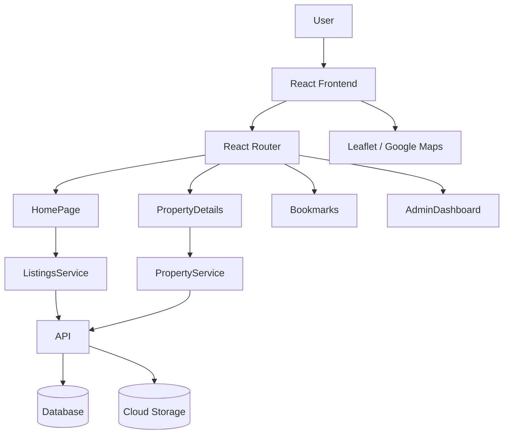

# HomeHunt - Real Estate Listing & Finder Platform


---

## Project Overview

HomeHunt is a modern real estate discovery platform built with React.  
The application allows users to explore, search, and bookmark properties while providing an intuitive UI similar to platforms like Zillow or 99acres.

The goal of this project is to demonstrate a scalable frontend architecture, real-world filtering systems, and a production-style React application structure.

Users can:

- Browse real estate listings
- Search properties by location, price, and property type
- View detailed property pages
- Explore properties on a map
- Save or bookmark listings
- Contact property agents or owners

Admins can manage listings through an admin dashboard.

---

## Tech Stack

### Frontend

- React.js
- React Hooks
- React Router
- Tailwind CSS / ShadCN UI

### Forms & Validation

- React Hook Form
- Yup

### State Management

- Redux Toolkit
- Context API

### Maps

- Leaflet.js
- Google Maps API (optional)

### Image Handling

- Firebase Storage
- Cloudinary

### Backend (Optional)

- Firebase Firestore
- Express.js
- MongoDB

---

## Core Features

### User Features

- Home page with featured property listings
- Advanced search with filters
- Property details page with gallery and map location
- Bookmark properties
- Contact form for property inquiries

### Admin Features

- Admin dashboard
- Add new listings
- Edit existing properties
- Delete listings
- Upload property images
- Track property activity

---

## Architecture Diagram



---

## Project Structure

```
src
 ├── components
 │   ├── PropertyCard
 │   ├── PropertyGallery
 │   ├── MapView
 │   └── SearchBar
 │
 ├── pages
 │   ├── Home
 │   ├── PropertyDetails
 │   ├── Bookmarks
 │   ├── Login
 │   └── AdminDashboard
 │
 ├── services
 │   ├── propertyService.js
 │   └── authService.js
 │
 ├── store
 │   ├── reduxStore.js
 │   └── slices
 │
 ├── hooks
 │   ├── useAuth
 │   └── useListings
 │
 └── App.js
```

---

## Product Roadmap

### Phase 1 - MVP

- Property listing page
- Property details page
- Search functionality
- Filters (price, location, property type)
- Bookmark properties
- Contact form

### Phase 2 - Advanced Features

- Map-based search
- Saved searches
- Admin dashboard
- Role-based authentication

### Phase 3 - Platform Features

- Real-time chat between buyers and agents
- Property visit scheduling
- Mortgage calculator
- Analytics dashboard

### Phase 4 - SaaS Expansion

- Multi-agent accounts
- Subscription model
- CRM integration
- Lead management dashboard

---

## Installation

Clone the repository

```
git clone https://github.com/yanamak89/homehunt.git
```

Install dependencies

```
npm install
```

Run development server

```
npm start
```

Open in browser

```
http://localhost:3000
```

---

## Future Improvements

- Progressive Web App (PWA) support
- Push notifications for saved searches
- Geo-based property recommendations
- Neighborhood analytics (schools, transport, safety)
- Property comparison tool

---

## Author

**Yana Makogon**

GitHub  
https://github.com/yanamak89

LinkedIn  
https://www.linkedin.com/in/yana-mac/


